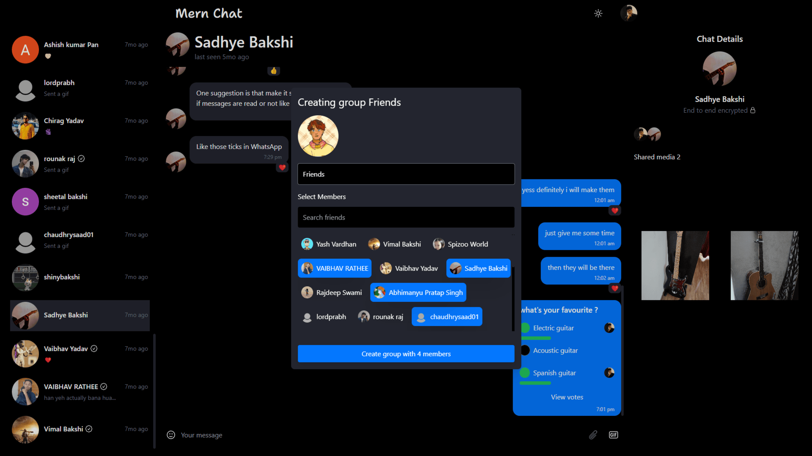
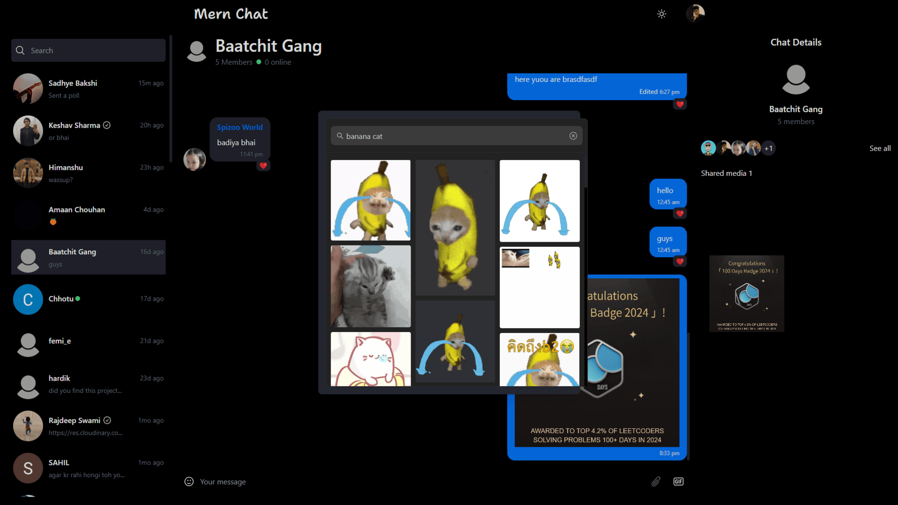
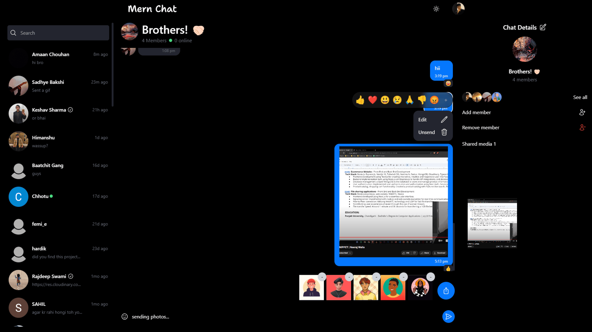

# **Next.js - E2EE Real-Time Chat App** 🗨️  

Next.js chat app is a modern, end-to-end encrypted (E2EE) real-time chat application designed for seamless and secure communication. Users can send messages, share files, react to messages, create group chats, and much more—all with robust security and privacy features.  

  
  
  

---

## **🚀 Features**  

### 🔒 **Privacy & Security**  
- **End-to-End Encryption (E2EE)** – Secure messages with advanced encryption.  
- **Private Key Recovery** – Retrieve your encryption key with MFA-protected email verification.  

### 💬 **Chat & Messaging**  
- **Real-time Messaging** – Instantly send and receive messages.  
- **Message Editing** – Edit messages after sending (with an edit indicator).  
- **Message Reactions** – React to messages with emojis (double-tap to like/unlike).  
- **Message Deletion** – Delete messages after sending.  
- **Typing Indicators** – See when someone is typing.  
- **Message Seen Status** – Know when your message is read.  

### 📢 **Notifications & Presence**  
- **Push Notifications** – Stay updated with real-time alerts.  
- **User Presence** – See who’s online in real time.  

### 🤝 **Social Features**  
- **Friends System** – Add friends and chat with them.  
- **Group Chats** – Create and participate in group conversations.  
- **Polling** – Create polls with single/multiple voting options.  

### 📁 **Media & File Sharing**  
- **GIF Support** – Send animated GIFs (powered by Tenor).  
- **File Sharing** – Send and receive files securely.  

### 🛠️ **Other Features**  
- **OAuth Integration** – Sign in with Google & GitHub.  
- **PWA Support** – Install next-js-chat-app as a Progressive Web App for a native-like experience.  

---

## **🛠️ Tech Stack**  

### **Frontend**  
- **⚛️ Next.js 15 + React 19** – Modern full-stack React framework.  
- **🛠️ Redux Toolkit + React-Redux** – Efficient global state management.  
- **🔗 React Hook Form + Zod** – Form handling & schema validation.  
- **🔄 Socket.IO Client** – Real-time communication.  
- **📅 Date-fns** – Date & time utilities.  
- **🎥 Framer Motion + Lottie-React** – Animations & dynamic UI effects.  
- **🔥 Firebase** – Push notifications & backend integration.  
- **💅 Tailwind CSS** – Responsive & scalable UI.  
- **🚀 Nodemailer** – Email handling.  
- **🔐 bcryptjs + jose** – Authentication & encryption.  
- **💬 Emoji-Picker-React + Gif-Picker-React** – Interactive media in chat.  
- **🛠️ Prisma ORM** – Database management.  

### **Backend**  
- **🟢 Node.js + Express** – Scalable backend API.  
- **🔄 Socket.IO** – Real-time bidirectional communication.  
- **🗄️ Prisma ORM** – Type-safe database management.  
- **🔐 JWT Authentication (jsonwebtoken)** – Secure authentication.  
- **☁️ Cloudinary** – Cloud storage for images & files.  
- **📧 Nodemailer** – Email notifications & MFA verification.  
- **🔑 Passport.js + Google OAuth** – OAuth-based authentication.  
- **🔥 Firebase Admin SDK** – Push notifications.  
- **🛡️ Helmet** – Security headers for protection.  
- **📝 Morgan** – HTTP request logging.  
- **🍪 Cookie-Parser** – Secure cookie handling.  
- **🛠️ Multer** – File uploads.  
- **🔄 CORS** – Cross-origin requests.  
- **🛠️ UUID** – Unique ID generation.  
- **⚙️ dotenv** – Environment variable management.  

---

## **🚀 Getting Started**  

### **1️⃣ Clone the Repository**  
```bash
git clone https://github.com/RishiBakshii/nextjs-chat-app
cd nextjs-chat-app
```

### **2️⃣ Set Up Environment Variables**  

#### **Backend Configuration**  
1. Navigate to the **backend** folder.  
2. Copy `.env.example` and rename it to `.env`.  
3. Replace the placeholder values with actual credentials.  
4. Make sure `backend/src/firebase-admin-cred.json` is correctly set up for Firebase authentication.  

📝 **Example (`backend/.env`)**:  
```ini
NODE_ENV=DEVELOPMENT
PORT=8000
JWT_SECRET=your-secure-jwt-secret
DATABASE_URL=your-database-url
FIREBASE_CREDENTIALS_PATH=./src/firebase-admin-cred.json
```

---

#### **Frontend Configuration**  
1. Navigate to the **frontend** folder.  
2. Copy `.env.development.example` and rename it to `.env.development`.  
3. Copy `.env.production.example` and rename it to `.env.production`.  
4. Fill in your API keys and URLs.  

📝 **Example (`frontend/.env.development`)**:  
```ini
NEXT_PUBLIC_TENOR_API_KEY=your-tenor-api-key
NEXT_PUBLIC_FIREBASE_API_KEY=your-firebase-api-key
NEXT_PUBLIC_BASE_URL=http://localhost:8000/api/v1
NEXT_PUBLIC_CLIENT_URL=http://localhost:3000
```

🚨 **Important Notes:**  
- Never expose sensitive credentials in `NEXT_PUBLIC_` variables.  
- Ensure the correct Firebase and API URLs are set.  

---

### **3️⃣ Install Dependencies & Run the Application**  

#### **Start the Backend First**  
```bash
cd backend
npm install
npm run dev
```
The backend will start at **http://localhost:8000**.  

---

#### **Then Start the Frontend**  
```bash
cd frontend
npm install
npm run dev
```
Visit **http://localhost:3000** in your browser.  

---

## **💡 Contribution Guide**  
Contributions are welcome! To contribute:  
1. **Fork** the repository.  
2. **Create a branch**:  
   ```bash
   git checkout -b feature-branch
   ```  
3. **Commit your changes**:  
   ```bash
   git commit -m "Add new feature"
   ```  
4. **Push to GitHub**:  
   ```bash
   git push origin feature-branch
   ```  
5. **Open a Pull Request** 🚀  

---

## **📧 Contact**  
For feedback or queries, reach out:  
📩 **[rishibakshiofficial@gmail.com](mailto:rishibakshiofficial@gmail.com)**  

---